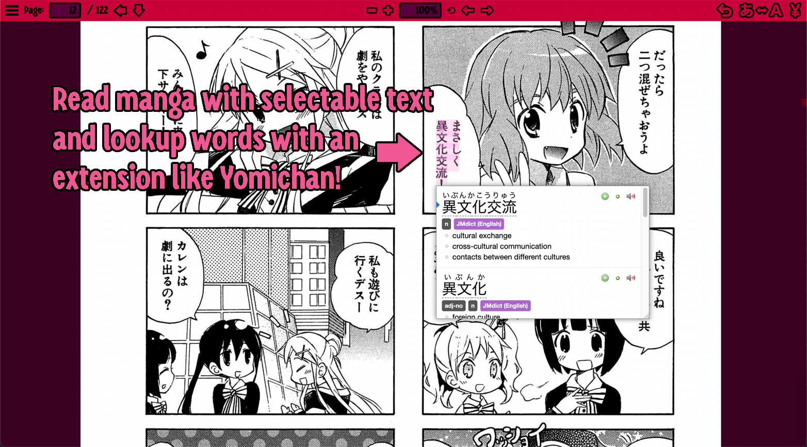
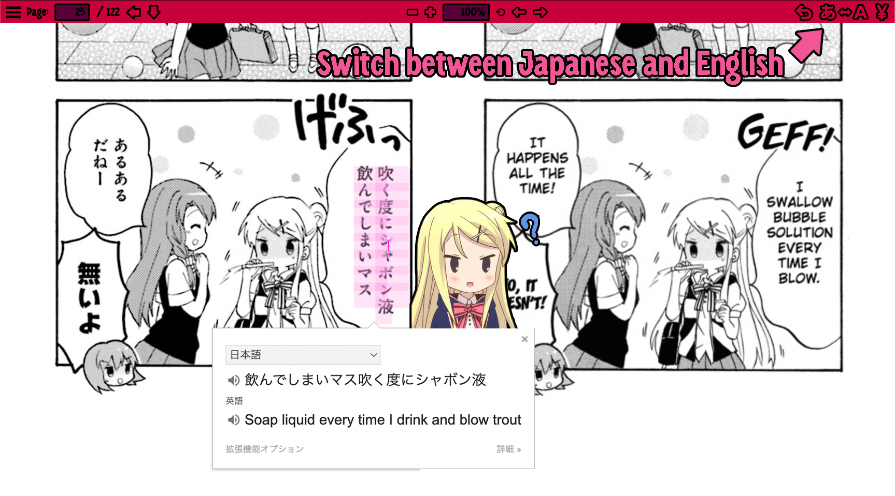
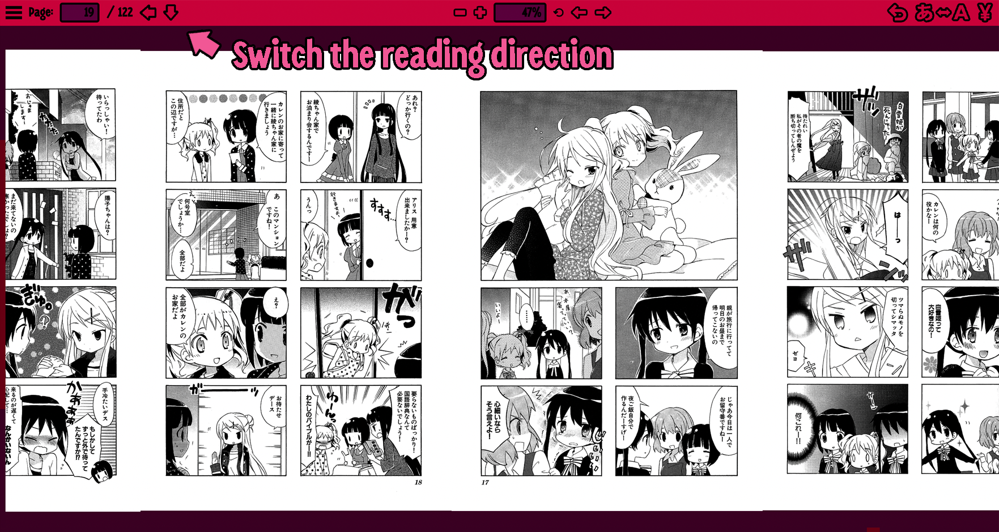

# Cutemanga.moe

Cutemanga is a manga viewer where you can read manga with selectable text (OCR) with a dictionary extension like Yomichan. It is a fun way to study Japanese. The manga is 
generated with [MangaOCR](https://github.com/kha-white/manga-ocr), and specifically we use [Mokuro](https://github.com/kha-white/mokuro) 
and [Mokuro2Pdf](https://github.com/Kartoffel0/Mokuro2Pdf) scripts to OCR the manga and convert them to PDF files. 

We have a custom PDF viewer which is explained in more detail below.

### Switching to English

You can quickly switch to an English-translated version of the manga to check that you are understanding it correctly. Since Google Translate
is very poor at translating vertical text, it often yields very unnatural/nonsensical dialogue, so it is better to refer a humanly-translated version 
instead.

### Reading Direction

You can change the reading direction between top to bottom (most common), or right to left, which is how manga are traditionally read.

### Official Website

Support the artist/publisher by buying the manga/anime from their website (a link is provided). 

### Tech Stack

- Languages: Typescript, LESS, HTML
- Front-end: React 
- Bundler: Webpack

### Hosting

First install Node.js if you don't have it already. 

https://nodejs.org/en/

To reduce costs, the whole "database" is stored in a single `database.js` file instead of using a 
real database. This works for me because I expect the content library to get that big.

You can look at the `database.example.js` to see the structure of the database and populate it on your own.

Clone the code from this repository and then install dependencies with `npm install`. \
Start the web server with `npm start`. 

All the web server does is load the `index.html` file, there is no real backend so this can be hosted as a static 
website. 

To load files from your local hard drive edit the pathname for the route `/Manga/*` in `server.tsx`.

### Anime Site
- [Cuteanime.moe](https://github.com/Moebits/Cuteanime.moe)
